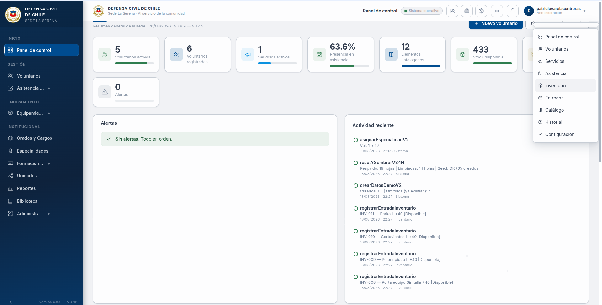
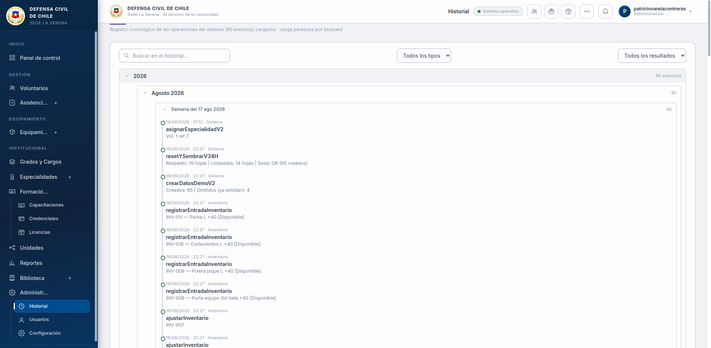
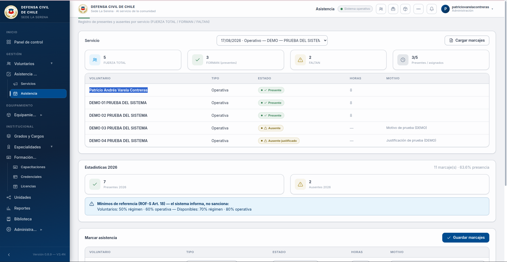
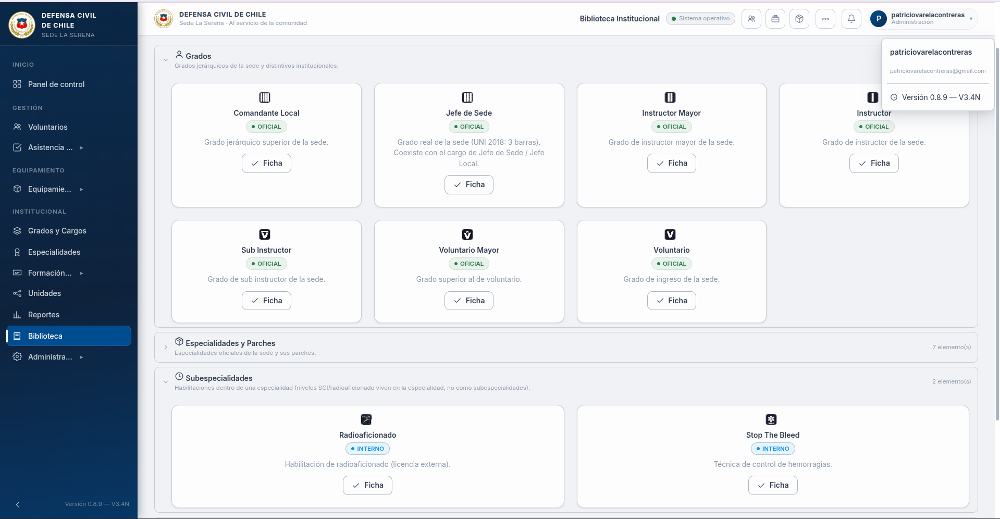

# 🛡️ Base de Datos Defensa Civil

Sistema integral de **gestión para Defensa Civil** construido sobre **Google Apps Script**
con Google Sheets como capa de datos y una **UI web propia** (single-page) servida por el
mismo Apps Script.

**Versión actual:** `v0.9.0` (línea V3.5)

## Módulos

- 👥 **Voluntarios**: fichas completas, grados, especialidades y parches
- 📅 **Eventos**: convocatorias y control de asistencia
- 📦 **Entregas e inventario**: catálogo, asignaciones y devoluciones
- 📊 **Dashboard**: indicadores del cuerpo
- 🔐 **Usuarios y permisos**: perfiles con permisos granulares
- 🖨️ Generación de **PDF** e impresión de formatos oficiales

## Arquitectura

```
Apps Script (backend .gs)  ←→  UI HTML propia (13_*–32_*.html)
        ↓                              ↑
   Google Sheets (datos)      google.script.run (puente)
```

Los archivos están **numerados por capa** (`00_Constantes`, `01_Utilidades`, …,
`12_WebApp`, `13_*` UI principal, `14_*`–`32_*` páginas hijas).

## Capturas

> Datos ficticios · capturas: agosto 2026 · v0.9.0


*Panel de control · ago 2026 · v0.9*


*Pantalla de carga · ago 2026 · v0.9*


*Ventana de registro LOG · ago 2026 · v0.9*


*Hoja de asistencia · ago 2026 · v0.9*


*Hoja biblioteca DC · ago 2026 · v0.9*
## Desarrollo con clasp

```bash
clasp login          # primera vez
clasp push           # subir cambios → Apps Script
clasp pull           # bajar cambios desde Apps Script
```

## CI

GitHub Actions verifica en cada push:

- ✅ Sintaxis de todos los `.js` (`node --check`)
- ✅ Pruebas automatizadas (`test_v34n.js` con jsdom)

## Estado

- ✅ En producción · etiqueta `v0.9.0`
- 📄 Detalle de avance: [`docs_ESTADO_PROYECTO.md`](docs_ESTADO_PROYECTO.md)

---

Desarrollado por [@2674321](https://github.com/2674321) · Coquimbo, Chile
